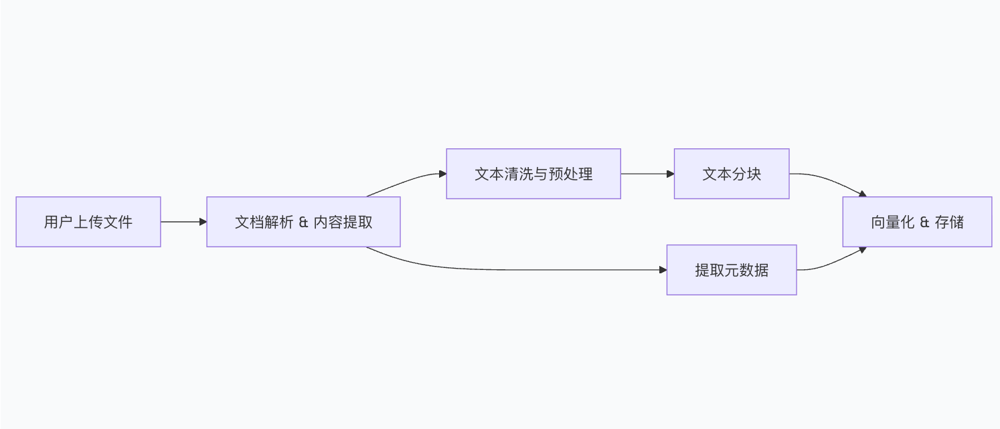

# 知识库
这个过程通常包含 上传、解析、清洗、分块、向量化 五个核心步骤。


## 流程
整个处理流程可以用下图来表示




1. 📤 文档上传与接收
这是管道的起点，负责接收用户上传的各种文件。系统需要支持批量上传，并对文件大小、类型进行初步校验。

2. 🔍 文档解析与内容提取
这是最关键的环节，目标是将不同格式的二进制文件，统一转换为纯文本内容。通常采用“格式识别 + 专用解析器”的策略：

  - PDF / DOCX / PPTX：使用pdf-parse或mammoth.js等库提取文本和结构。

  - HTML：使用cheerio等库解析标签并提取正文。

  - 代码文件：按语法解析，保留结构和注释。

  - 图像/音频：通过OCR或语音转文本服务提取内容。

3. 🧹 文本清洗与预处理
提取的原始文本通常包含噪音，需要进行清洗。常见的清洗步骤包括：

  - 去除多余的空格、换行符。
  
  - 移除页眉、页脚等无关信息。
  
  - 进行指代消解等可选的文本规范化处理。

4. ✂️ 文本分块 (Chunking)
为了让大模型能精准检索，需要将长文档切分成更小的“文本块”（Chunk）。

  - 固定大小分块：按固定字符数（如500字）切分，简单但可能破坏语义。
  
  - 递归分块：按段落、句子等层级递归切分，是更常用的策略。
  
  - 语义分块：利用模型判断语义边界，效果最好但成本也最高。

5. 🧬 向量化与存储
最后一步，将文本块转换为向量并存储，为后续的语义检索做准备。

  - 向量化 (Embedding)：调用嵌入模型将文本转为向量数组。
  
  - 存储 (Vector Store)：将向量及其对应的元数据存入专门的向量数据库，如 pgvector、Pinecone等。


## 设计结构
```md
 rag/
    ├── rag.module.ts                 # 模块定义，组织依赖注入
    ├── rag.controller.ts             # HTTP 路由层，处理请求/响应
    ├── rag.service.ts                # 核心业务逻辑（切片、向量化、检索）
    ├── document-loader.service.ts    # 文档解析层（PDF/Word/HTML → 纯文本）
    ├── vector.service.ts             # 向量数据库适配层（pg-vector 操作）
    └── entities/                     # TypeORM 实体定义, 数据库实体
        └── knowledge-base.entity.ts
```

## TODO：未来规划
  - 上述只是 丐版，提取的只有文字

  - 可在此基础上升华：向企业级的知识化 拓展
    - 融合成md
    - 多文件格式解析支持
    - 图片、音视频等等
    - oss 存储
    - 。。。。。。